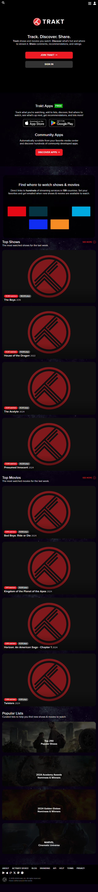
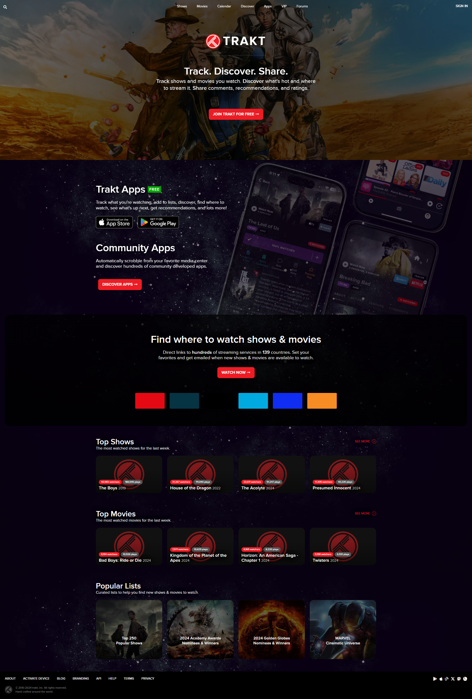
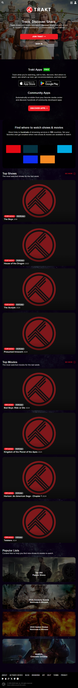
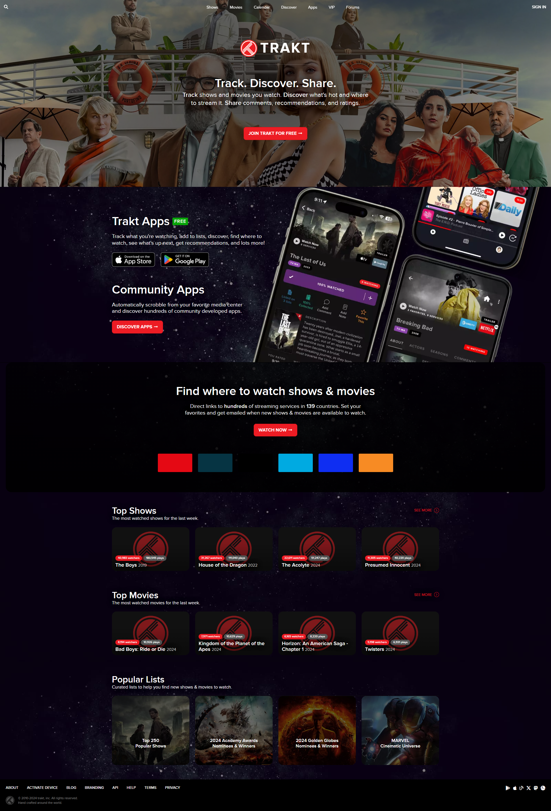
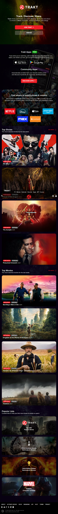

## Description

This repository contains a collection of scripts and tools for web scraping, screenshotting, and automated testing using Playwright.

### Installation

```sh
npm init playwright@latest
```

```sh
√ Do you want to use TypeScript or JavaScript? · JavaScript
√ Where to put your end-to-end tests? · tests
√ Add a GitHub Actions workflow? (y/N) · true
√ Install Playwright browsers (can be done manually via 'npx playwright install')? (Y/n) · true

Inside that directory, you can run several commands:

  npx playwright test
    Runs the end-to-end tests.

  npx playwright test --ui
    Starts the interactive UI mode.

  npx playwright test --project=chromium
    Runs the tests only on Desktop Chrome.

  npx playwright test example
    Runs the tests in a specific file.

  npx playwright test --debug
    Runs the tests in debug mode.

  npx playwright codegen
    Auto generate tests with Codegen.

We suggest that you begin by typing:

    npx playwright test

And check out the following files:
  - .\tests\example.spec.js - Example end-to-end test
  - .\tests-examples\demo-todo-app.spec.js - Demo Todo App end-to-end tests
  - .\playwright.config.js - Playwright Test configuration
```

## Run a test

```sh
npx playwright test
```

View Test report

```sh
npx playwright show-report
```

https://playwright.dev/docs/screenshots

## Run scripts

### For Screenshots

```sh
npm run snap
```

### For Scraping

```sh
npm run scrape
```

### Full page screenshot not fully renderd

playwright screenshot page not loaded  
https://github.com/microsoft/playwright/issues/620

# Screenshots

| **Count** | **Device** | **Animation** | **Scrolling** | **Screenshot**                                                                                     |
| --------- | ---------- | ------------- | ------------- | -------------------------------------------------------------------------------------------------- |
| 1         | Mobile     | Enabled       | Disabled      |     |
| 2         | Web        | Enabled       | Disabled      |          |
| 3         | Mobile     | Disabled      | Disabled      |  |
| 4         | Web        | Disabled      | Disabled      |       |
| 5         | Mobile     | Enabled       | Enabled       |   |
| 6         | Web        | Enabled       | Enabled       |        |
